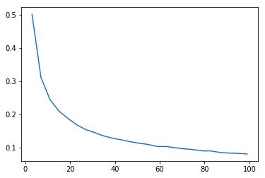
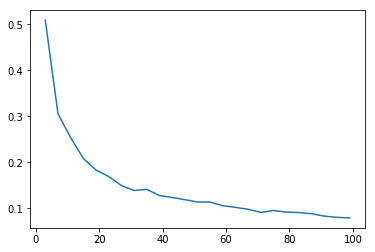
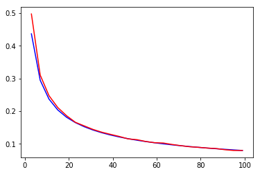

```
Assume there are two parties, Party 0 and Party 1.
Say there are 3 voters.
​
There are exactly eight possible ways in which votes for the 2 parties could be cast:
000
001
010
011
100
101
110
111
​
Now, consider the following subset:
010
011
100
101
​
From the point of view of the third voter, these are the only votes that count.
Why ?
​
Because, for something not in the subset like say 000
the decision to go with Party 0 has already been made by 1st & 2nd voter. 
The 3rd voter's vote is immaterial because 0 is already a majority.
​
Whereas for a member of the subset say 010
the decision to go with 0 or a 1 is still open because they have equal votes.
Voter 3 comes along, casts his vote of 0 and swings the decision to Party 0 ( the case 010 )
Voter 3 comes along, casts his vote of 1 and swings the decision to Party 1 ( the case 011 )
So Voter 3 matters.
​
How much does Voter 3 matter ?
Well, the ratio of the size of the subset to the size of the whole set 
is the probability of Voter 3 mattering. 
In this case, its 4/8  = 0.5
​
In other words, if you have a family of 3 - 
Mom, Dad & Kid, 
you want to vote on whether to visit the moviehouse or the museum, 
you should vote. 
Because your vote matters. 
There's a 50% chance you can make a difference.
​
As kids in larger families know, their votes matter less and less :(
If your standard classroom of 31 kids
is choosing between a movie and a musuem, 
chances that the 31st kid can swing the vote is pretty low. 
How low ?
​
We could quantify all this with basic high school math.
However, we shall use some programming machinery instead.
​
1. Let's start with numpy
2. Then scipy
3. Then tensorflow
4. Finally, a tad bit of plain simple math.
```


```python
# LETS DO NUMPY

import numpy as np
import matplotlib.pyplot as plt
import timeit

def numpyChancesOfSwingVote(n):
    # number of simulations
    N = 100000
    
    # a binomial distribution of n voters with equal choice of 50% among [0,1]
    # lets create N such rows ie. (N,n) 
    u = np.random.binomial(1,0.5,(N,n)) 
    
    # number of times the last voter makes a difference
    ctr = 0
    
    for i in range(N):
        arr = u[i]
        
        # get rid of the last voter
        excludelast = arr[:n-1] 
        
        # you want to count how many votes are 0 and how many are 1
        bc = np.bincount(excludelast.ravel())
        
        #print(bc)
        # If the zero-votes are identical to one-votes excluding the last voter
        # then the last voter makes a difference!
        if len(bc) == 2 and bc[0] == bc[1]:
            ctr += 1
    
    # spit out the ratio of subset size over total size
    return ctr/N

start_time = timeit.default_timer()

X = np.arange(3,101,4)
Y = list(map(numpyChancesOfSwingVote, X))
elapsed1 = timeit.default_timer() - start_time

plt.plot(X,Y)
plt.show()

# Family of 3 kids
print("Chances of swing vote in a family of 3 kids: " + str(numpyChancesOfSwingVote(3)))

# Class of 31 kids
print("Chances of swing vote in a classroom of 31 kids: " + str(numpyChancesOfSwingVote(31)))

# A school of 301 kids
print("Chances of swing vote in a school of 301 kids: " + str(numpyChancesOfSwingVote(301)))
```





    Chances of swing vote in a family of 3 kids: 0.50092
    Chances of swing vote in a classroom of 31 kids: 0.14363
    Chances of swing vote in a school of 301 kids: 0.04576


```python
# LETS DO SCIPY

from scipy.stats import binom

def scipyChancesOfSwingVote(n):
    # number of simulations
    N = 100000
    
    # a binomial distribution of n voters with equal choice of 50% among [0,1]
    # lets create N such rows ie. (N,n) 
    u = binom.rvs(1,0.5, size=(N,n))
    # number of times the last voter makes a difference
    ctr = 0
    
    for i in range(N):
        arr = u[i]
        
        # get rid of the last voter
        excludelast = arr[:n-1] 
        
        # If there are equal number of 0's and 1's, the mean is 0.5
        if np.mean(excludelast) == 0.5:
            ctr += 1
    
    # spit out the ratio of subset size over total size
    return ctr/N

start_time = timeit.default_timer()

X = np.arange(3,101,4)
Y = list(map(scipyChancesOfSwingVote, X))
elapsed2 = timeit.default_timer() - start_time

plt.plot(X,Y)
plt.show()

# Family of 3 kids
print("Chances of swing vote in a family of 3 kids: " + str(scipyChancesOfSwingVote(3)))

# Class of 31 kids
print("Chances of swing vote in a classroom of 31 kids: " + str(scipyChancesOfSwingVote(31)))

# A school of 301 kids
print("Chances of swing vote in a school of 301 kids: " + str(scipyChancesOfSwingVote(301)))
```


    Chances of swing vote in a family of 3 kids: 0.50026
    Chances of swing vote in a classroom of 31 kids: 0.14632
    Chances of swing vote in a school of 301 kids: 0.0459


```python
# LETS DO TENSORFLOW

import tensorflow as tf
sess = tf.InteractiveSession()

def tfChancesOfSwingVote(n):
    N = 10000  # samples scaled down 10x, since tensorflow takes too long o/w
    u = tf.random_uniform((N,n), minval= 0, maxval=2, dtype=tf.int32)
    mat = u.eval() # evaluate the tf object ONLY ONCE, NOT IN A BLOODY LOOP
    ctr = 0
    for i in range(N):
        arr = mat[i] # work off of the evaluated matrix
        excludelast = arr[:n-1] 
        if np.mean(excludelast) == 0.5:
            ctr += 1
    
    return ctr/N

start_time = timeit.default_timer()
X = np.arange(3,101,4)
Y = list(map(tfChancesOfSwingVote, X))
elapsed3 = timeit.default_timer() - start_time

plt.plot(X,Y)
plt.show()

# Family of 3 kids
print("Chances of swing vote in a family of 3 kids: " + str(tfChancesOfSwingVote(3)))

# Class of 31 kids
print("Chances of swing vote in a classroom of 31 kids: " + str(tfChancesOfSwingVote(31)))

# A school of 301 kids
print("Chances of swing vote in a school of 301 kids: " + str(tfChancesOfSwingVote(301)))
```





    Chances of swing vote in a family of 3 kids: 0.5111
    Chances of swing vote in a classroom of 31 kids: 0.1483
    Chances of swing vote in a school of 301 kids: 0.0442


```python
# Speed benchmarks
# tf is quite slow so we have scaled the problem size down by 10x
# len(X) is number of times tf function is called, & sample size is smaller by 10x
# So the true tf speed assuming linearity is len(X) * 10 * speed

print("Numpy: " + str(elapsed1) + "s  Scipy: " + str(elapsed2) + "s  TF: " + str(len(X) * 10 * elapsed3) + "s")
```

    Numpy: 10.426483891991666s  Scipy: 54.72452995099593s  TF: 1351.2752744936734s


```
The Binomial Distribution can be approximated by a Gaussian.
For large n with p ~ 0.5, with np > 5 & npq > 5 i.e for n >= 20, since p = q = 0.5
Bin(n,p) ~ Norm( mu = n*p, sigma = sqrt(n*p*(1-p)))

We seek to estimate the probability of exactly half the trials succeeding & half the trials failing.
Essentially, on a gaussian distribution with some (mu,sigma), we want the chances of X = n/2.

But the gaussian is a continous distribution, and we seek to estimate the probability of a discrete event.
The answer would be zero, unless we apply a so-called continuity correction.
Essentially, we could create an interval around n/2, and integrate over that interval.
[n/2-1/2,n/2 + 1/2] would give us an interval

When we find the probability of our continous random variable inhabiting that interval, 
that's about the same as the probability of our discrete rv equalling the center of the interval.
The approximation gets better as n gets larger and approx error converges to zero almost surely.

Essentially, what we seek is this probability:
prob(n = [n/2-1/2, n/2+1/2], Norm(mu = n*p, sigma = sqrt(n*p*p))
```


```python
# LETS DO MATH

from scipy.stats import norm
def mathChancesOfSwingVote(X):
    n = X
    p = 0.5
    mu = n*p # this is the mean of the normal approximation to the binomial
    sigma = np.sqrt(n*p*p) # stdev of the approximation
    
    top = norm.cdf(n/2 + 0.5,mu,sigma) # the probability from [-inf, n/2 + 1/2]
    bottom = norm.cdf(n/2 - 0.5,mu,sigma) # the probability from [-inf, n/2 - 1/2]
    return top - bottom # the probability from [n/2 - 1/2, n/2 + 1/2]

X = np.arange(3,101,4)
Y = list(map(mathChancesOfSwingVote, X))
Ytrue = list(map(numpyChancesOfSwingVote, X))

plt.plot(X,Y, 'b') # the blue is the approximation
plt.plot(X,Ytrue, 'r') # the red is the true value
plt.show()

# Family of 3 kids
print("Chances of swing vote in a family of 3 kids: " + str(mathChancesOfSwingVote(3)))

# Class of 31 kids
print("Chances of swing vote in a classroom of 31 kids: " + str(mathChancesOfSwingVote(31)))

# A school of 301 kids
print("Chances of swing vote in a school of 301 kids: " + str(mathChancesOfSwingVote(301)))

# A city of million voters
print("Chances of swing vote in a city of 1000001 voters: " + str(mathChancesOfSwingVote(1000001)))
```





    Chances of swing vote in a family of 3 kids: 0.4362971383492269
    Chances of swing vote in a classroom of 31 kids: 0.14253755804075885
    Chances of swing vote in a school of 301 kids: 0.04596384948361121
    Chances of swing vote in a city of 1000001 voters: 0.0007978840288803135


```
Notes on the code:

1. In numpy, np.random.binomial(MAX,p,(N,n)) gives you (Nxn) samples, each sample is the number of SUCCESSES if MAX trials were performed with p being the probability of success in a trial.
Hence if p = 1, you simply get MAX. 
p=0 gets you 0. 
p  between 0 & 1 would give you a number between [0,MAX]
To simulate a voting scenario, np.random.binomial(1,0.5) would give you number of successes if you run 1 trial with 50% chance of winning, so returns either a 0 or a 1. To get (Nxn) samples, use np.random.binomial(1,0.5,(N,n))

2. Given an array like [0,1,0,0,1,1,] np.bincount counts the number of 0 bins & number of 1 bins.
You want to make sure both zero & 1 bins exist (len(bc) ==2), & then check the count.

3. scipy.stats.binom.rvs API is identical to np.random.binomial

4. It should be clear that instead of counting zeros & ones in an array, we can simply compute the mean of the array. If there were equal number of 0s & 1s, the mean should be 0.5

5. In tensorflow, the random uniform distribution with min of 0 & max of 2 is identical to a binomial with 1 trial & 50% chance of success. For Nxn samples, you have
tf.random_uniform((N,n), minval= 0, maxval=2, dtype=tf.int32)

6. Evaluate the tensor exactly once ( expensive!) and store results in some array that can then be indexed into. Once you have an interactive tensorflow session (sess = tf.InteractiveSession()), the eval() op on a tensor evaluates its contents.

7. Regards speed of execution, numpy >>  scipy >> tf. Numpy is way faster. tf's sample size has been scaled down 10x from 100k to 10k, to let it complete fast. 

8. All these methods are pretty dumb compared to just using the gaussian approximation to the binomial. However, programmers don't grok math, so this is where we are.


Summary: 
While it is important to have the ability to swing the vote in your party's favor,
that ability dissipates exponentially.

It isn't why voters vote.

You have a 50% ie. 1 in 2 chance of swinging the vote in your family of 3.
Your chances are down to 1 in 7 in your classroom of 31.
Your chances are further down to 1 in 25 in your school of 301.
As a voter in a small city of million citizens, your chances are 1 in 1250.

Furthermore, in a real election, if a single voter can actually swing the vote, 
the votes are scrapped & there's either a recount or a re-election!
So there's no point to computing this artificial metric.

Get out and vote!
```
